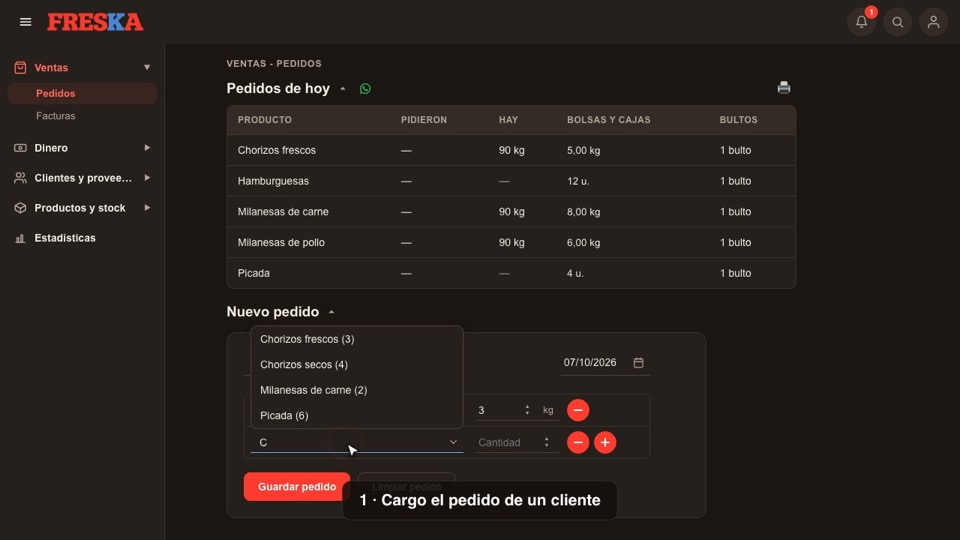
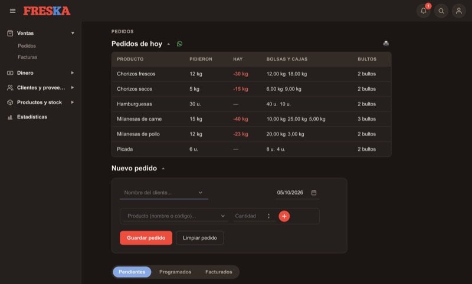
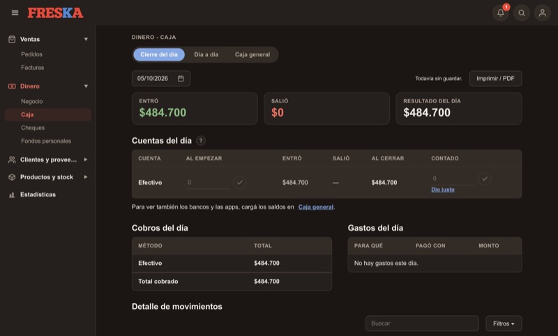
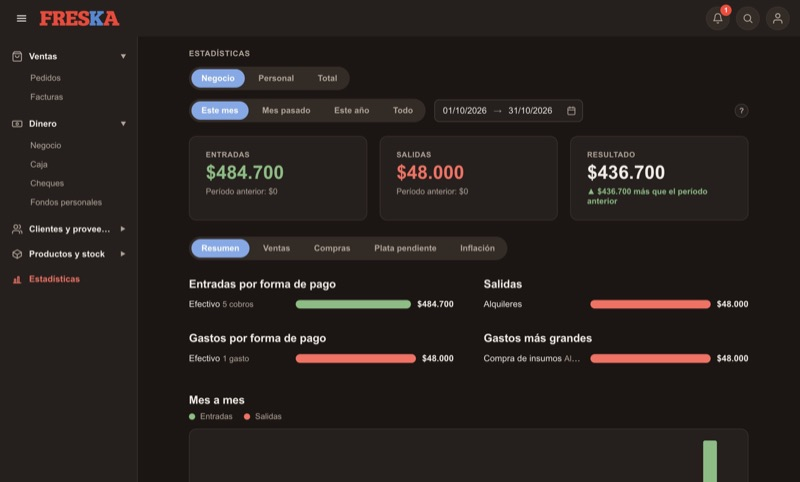

# FRESKA Gestión

Aplicación de escritorio para llevar un negocio de venta de carne: pedidos, facturas, cobros, caja, gastos, proveedores y stock en un solo lugar. La hice para reemplazar el cuaderno, la calculadora y la planilla de Excel con los que se manejaba un comercio real, y hoy se usa todos los días.

> Este repositorio es una copia sin datos reales ni historial: los clientes, proveedores y montos que aparecen son de ejemplo.

[](docs/freska-demo.mp4)

*Recorrido de 45 segundos (pedido → factura → cobro → caja y estadísticas), con datos ficticios.*

## Qué hace

- **Ventas:** pedidos (incluidos los programados para otro día) que se convierten en factura con un clic; precios por cliente o consumidor final; notas de crédito.
- **Dinero:** cobros y cuenta corriente de cada cliente, cheques, gastos con categorías, otros ingresos, cierre de caja del día y caja general con varias cuentas.
- **Clientes y proveedores:** fichas con saldo, historial, vendedores con comisión sobre lo cobrado, compras a proveedores.
- **Productos y stock:** catálogo, stock por artículo, rendimiento de la carne y insumos con mínimos y avisos.
- **Estadísticas:** entradas, salidas y resultado por período, formas de pago, gastos más grandes, ventas y compras.
- **Usuarios y permisos:** una contraseña por persona, roles (administrador y empleado), bloqueo por intentos fallidos y por inactividad, y registro de las anulaciones con su motivo.
- **Copias de seguridad:** automáticas y manuales.

## Capturas

| Pedidos | Cierre de caja | Estadísticas |
| --- | --- | --- |
|  |  |  |

## Tecnologías

- **Electron** (aplicación de escritorio) y **JavaScript** puro, sin frameworks.
- **SQLite** con `better-sqlite3` (base local en la computadora del negocio).
- **HTML y CSS** propios, con modo claro y oscuro.
- `electron-builder` y `electron-updater` para el instalador de Windows y las actualizaciones automáticas.
- Tests con el ejecutor de pruebas de Node.

## Cómo probarla

Hace falta [Node.js](https://nodejs.org) instalado.

```bash
npm install
npm start
```

La primera vez pide crear la contraseña del administrador. Los datos se guardan en una carpeta del sistema, no en este repositorio.

**Sin instalar nada más que un servidor de archivos**, la interfaz también corre en el navegador con datos de ejemplo en memoria:

```bash
python3 -m http.server 8000 --directory src/renderer
```

Abrí `http://localhost:8000` e ingresá con el usuario `Administrador` y la contraseña `1234` (solo en este modo de prueba).

> El instalador (`npm run dist:win`) y las actualizaciones automáticas son solo para Windows. En Mac y Linux se corre desde el código con `npm start`.

## Tests

```bash
npm test
```

Corren sobre una base temporal y cubren dinero (incluida una prueba con operaciones al azar), stock, copias de seguridad, usuarios, vendedores y estadísticas. Todo cambio que toca plata o stock lleva su test.

## Estructura

```
src/
  main/            proceso principal de Electron
    servicios/     un archivo por tema (clientes, facturas, caja, stock…)
    preload.js     puente seguro hacia la interfaz
  db/              esquema, migraciones y copias de seguridad
  renderer/        interfaz (un archivo por pantalla) y datos de ejemplo
tests/             pruebas automáticas
build/             ícono del instalador
docs/              demo y capturas
```

## Sobre el proyecto

Lo desarrollé yo, de punta a punta: entendí cómo trabaja el negocio, definí las reglas del dinero y del stock, armé las pantallas, lo probé, lo instalé y lo sigo mejorando con lo que el dueño me va pidiendo.

**Sofía Garnier** · [LinkedIn](https://www.linkedin.com/in/sofia-garnier) · [Portfolio](https://sofia-garnier.vercel.app)

## Licencia

Todos los derechos reservados. El código está publicado para que se pueda leer y evaluar, no para reutilizarlo.
